# Controlling Lights via Script

First of all, open the first tutorial scene from the scene folder called `Tutorial-1-LightingBasics`, you should be met with a scene like in the image below.

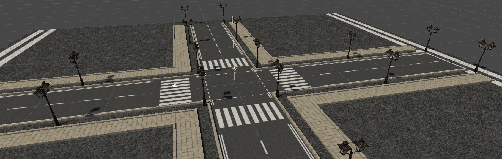

# Adding a Point light
To add a point light, you can just simply right click in your scene hierarchy and go to `Light > Point Light`.

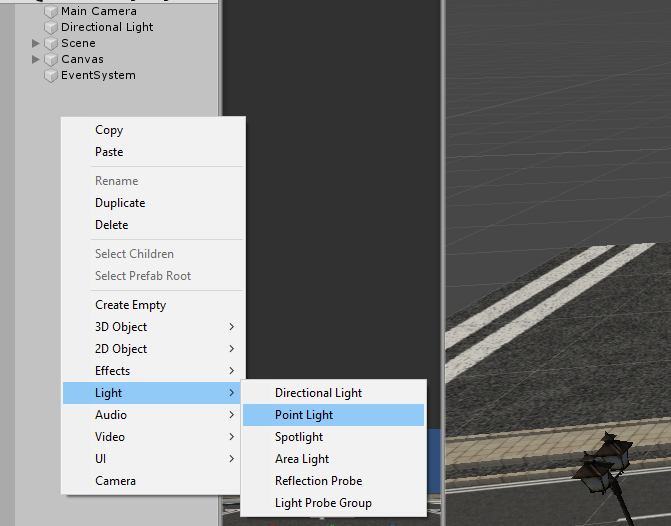

A point light will emit light from a certain point, as you can see in the image below, the ground below the point light is slightly lighter than the rest of the ground.

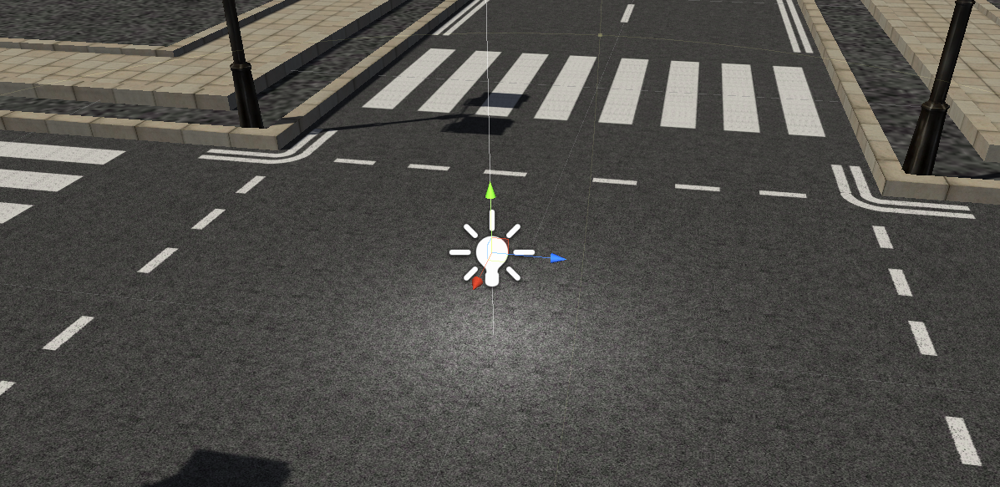

You can change the values of the light using the inspector, the only values we need to worry about at the moment are:

- **Intensity** - The Brightness of the light
- **Range** - The Distance the light will travel
- **Colour** - The colour of light that will be emitted
- **Shadow Type** - Whether to cast hard, soft or no shadows

Have a play with the settings and see what you can do.

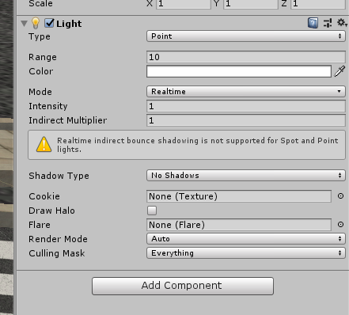

# Controlling the light via script
To control the options of the light via script, we will first need to **make an Empty game object**, call it something similar to `Light Manager`.

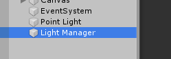

For now, we are going to change the options of one light. Go to your scripts folder and **create a script** and name it similar to `CS_LightManager`, then **drag that script** onto your `Light Manager` game object.

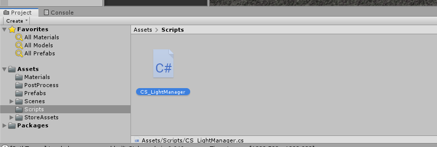

If done correctly, you will be able to see the script in the inspector of the Light manager.

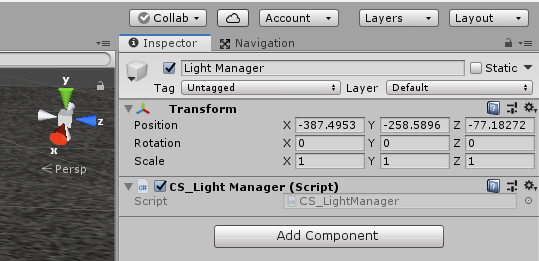

Now **open the script.**

## Scripting
First, we're going to need to add a member variable to reference our light.

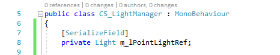

Then in our start function, we can start to change the options of the light, an example is shown below but try and play around with the values to see what you can produce.

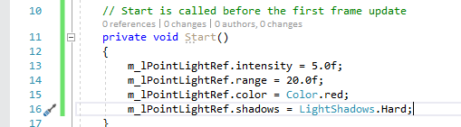

## Adding the reference
Now all we have to do is go back to Unity and drag our point light into our `Light Manager` game objects inspector slot.

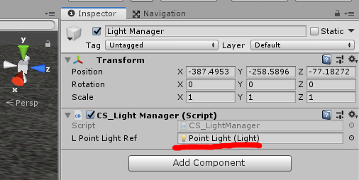

Now when you hit play, you should see your Point light take on the properties that you specified in the code.

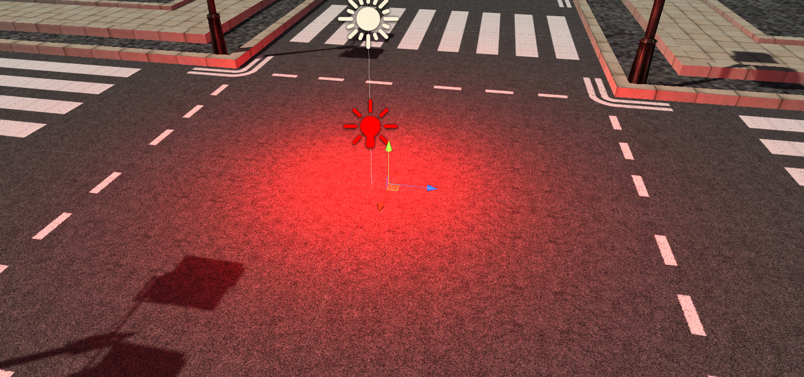

# Connecting it to the UI Sliders
As you may have noticed, the tutorial scene comes with some sliders for setting the colour of the light. The next step is to connect our point light to these sliders so that the colour and the intensity changes for us.

#### Member Variables
To do this, we will need member variables to reference each of the sliders.

*Don't forget to add `using UnityEngine.UI;` at the top of your script!*

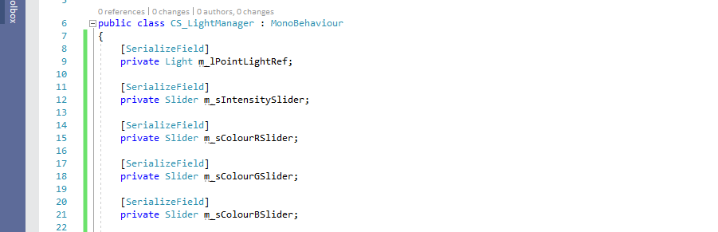

#### Listener function
Then we need to add a **Public Function** to our script, I've called mine `SliderDelegateFunction`. For now, you can leave the inside of the function empty.

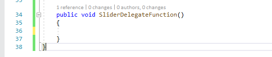

#### Delegates
The next step is to add **Listener calls** to our sliders, so that when we use the slider in game, a function is called to change the colour of the light.

This is less intensive than just putting your `SliderDelegateFunction` into `Update()`.

So in your start function, delete the code we wrote earlier and replace it with the following:

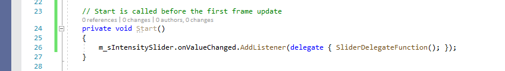

*This makes it so the `SliderDelegateFunction()` is called everytime we change our Intensity Slider!*

Repeat this for the other sliders, code is in the dropdown below if you need it.

    
Code for other functions

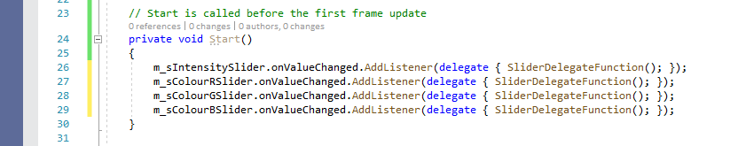

## Slider Delegate Function
Now all we have to do is fill in our function so change the actual point light.

We can change the colour of the Point Light by setting its value equal to a colour, but since we're constructing an RGB value from 3 different sliders, we will need to set it equal to a **Vector4** and add in our slider values in RGB order.

Then we can just set the intensity of the Point Light with the intensity sliders value.

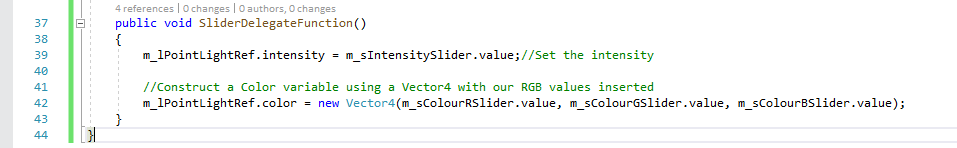

# Slider References
Now all we have to do is head back to Unity and add our sliders as references to the `Light Manager` game objects script.

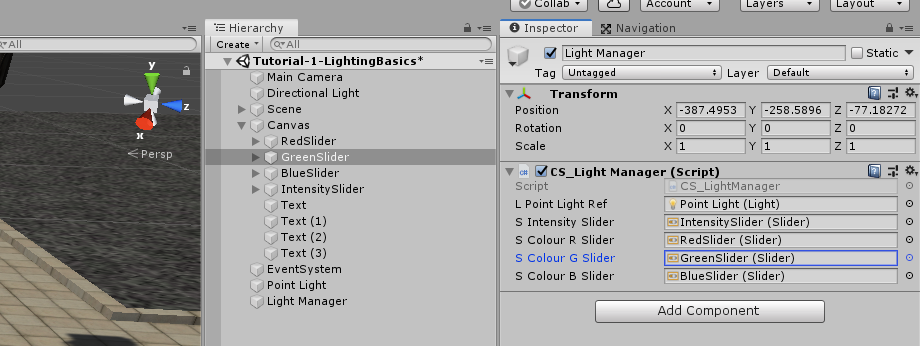

Now when you hit play, you should be able to control your Point Lights settings with the sliders on screen!

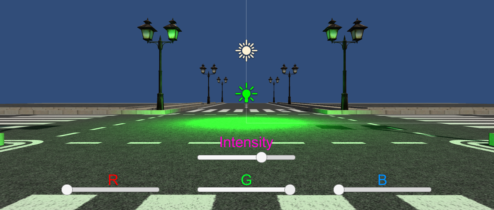

# Adding Multiple Lights
To quickly add multiple lights to our scene, we are going to populate each of the street lamps in the scene with Point Lights.

We can do this by going to our prefabs folder, and double clicking on the StreetLamp prefab in there.

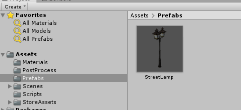

This should open the Prefab editor.

We're just going to simply add a point light and position it between the two lamps.

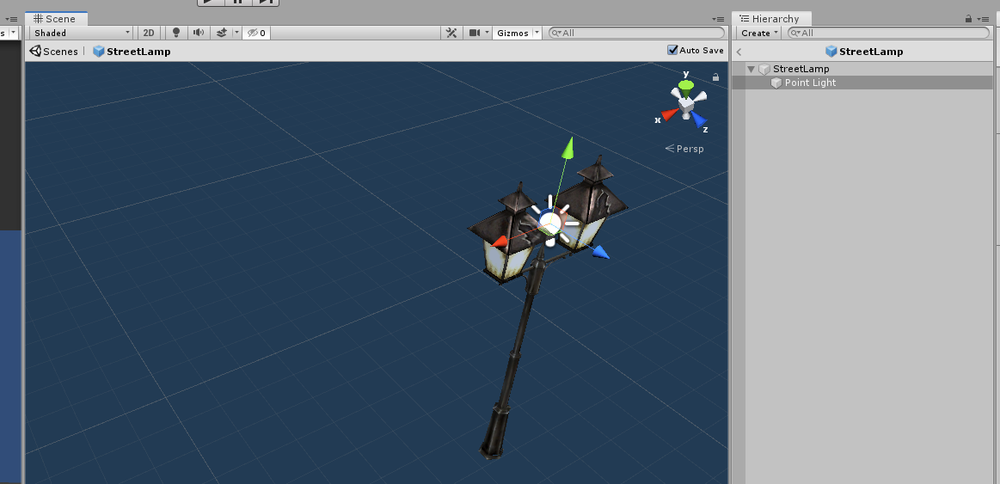

Save the prefab and head back to the scene, you should now see that all of the lamps in the level now have a Point Light on them.

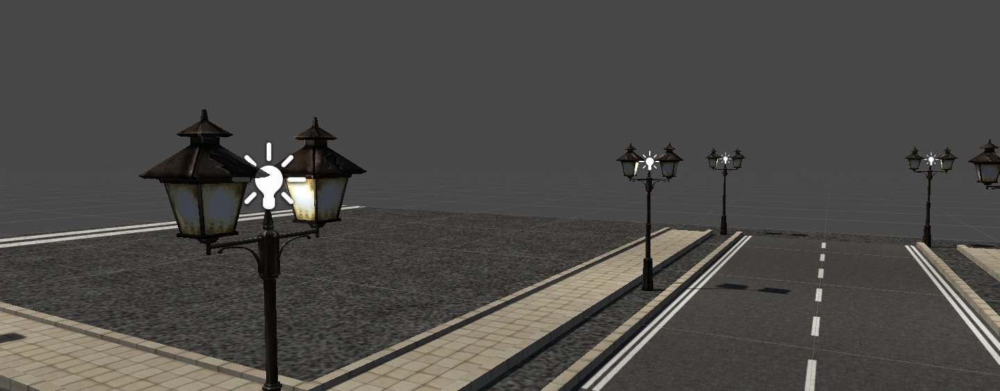

# Controlling Multiple lights
To control all of these lights with the script that we made earlier, we will have to make a couple of changes.

#### Member Variables
The first change we will need to make is to change our Light member variable into a list of lights and then construct it.

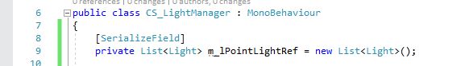

#### SliderDelegateFunction
We then need to change the slider delegate function to support Lists, instead of just a singular light.

We can do this by looping through the list using a `foreach` loop.

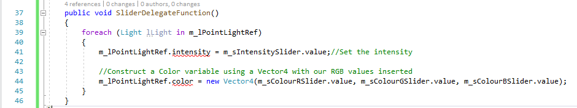

Each time the loop iterates and goes to the next light, it will be stored in the `foreach` loop in the variable `lLight`, so instead of `m_lPointLightRef`, we just need `lLight` now.

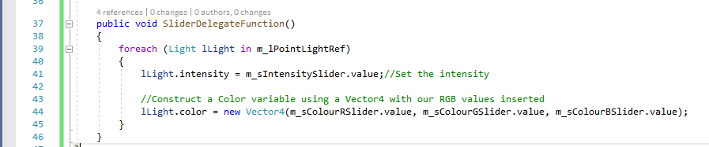

# Adding the Light references
Head back to Unity.

To get this to work, you will need to add each of your lights to your `Light Manager` game object's inspector slot.

The easiest way to do this is to click on your `Light Manager` Game object and **Lock the Inspector**, this will stop the inspector from changing everytime you click a different game object.

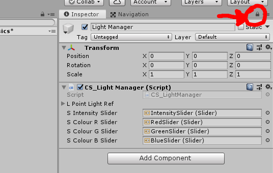

The next step is to find all of the lights in the level, we can do this using the Scene Hierarchy's search function, select all of your lights, and drag them into the `Light Manager`'s inspector slot for your list.

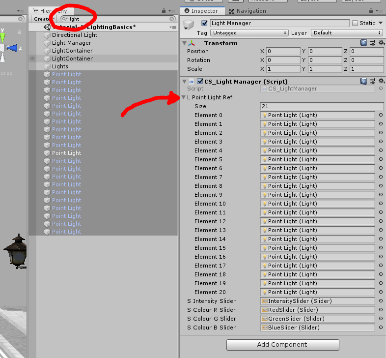

Now when you hit play, you should be able to control all of your lights!

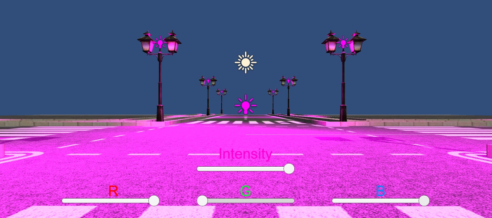