# Player Search Light

First of all, open the first tutorial scene from the scene folder called `Tutorial-2-Spotlight`, you should be met with a scene like in the image below.

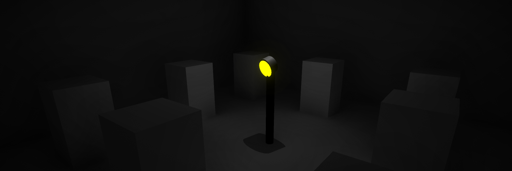

# Adding the Spotlight
We can add our spotlight to our scene the same way that we add a Point Light to our scene. Right click in our scene Hierarchy and go to `Light > Spot Light`. Make sure that this is a child of of the `Spotlight` game object that is already in the scene.

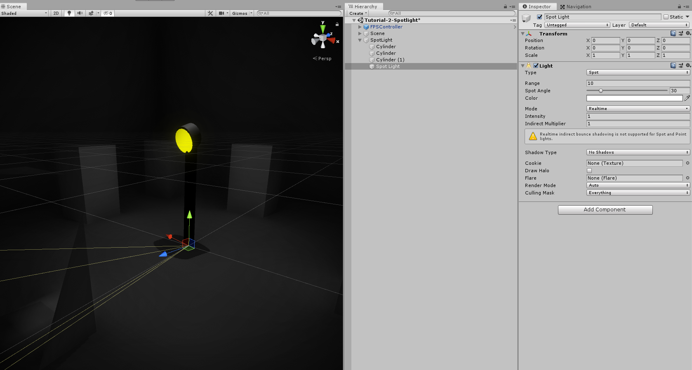

The Spotlight has a few more properties to edit than the Point light does, the one we need to worry about is **`Spot Angle`**. This controls how wide the spotlight spreads, have a play around with it to see what it does.

# Positioning the Spotlight
The spotlight needs to go at the top of the prefab, so drag it upwards until it is inline with the Yellow part of the prefab.

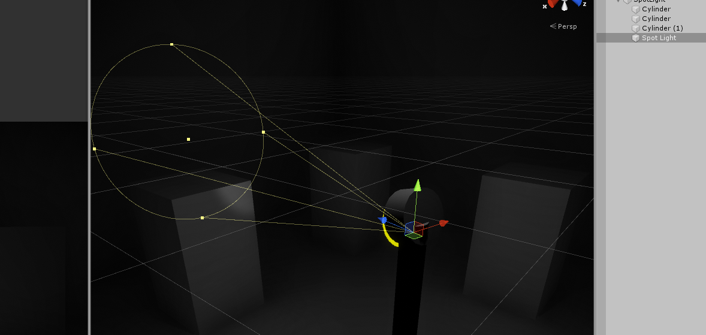

# Play with the settings
Decide what settings you want to have for your spotlight. Change the following:

- Rotation
- Range
- Spot Angle
- Colour
- Intensity
- Indirect Multiplier
- Shadow Type

After editing those settings I was able to get my SpotLight to look like the following:

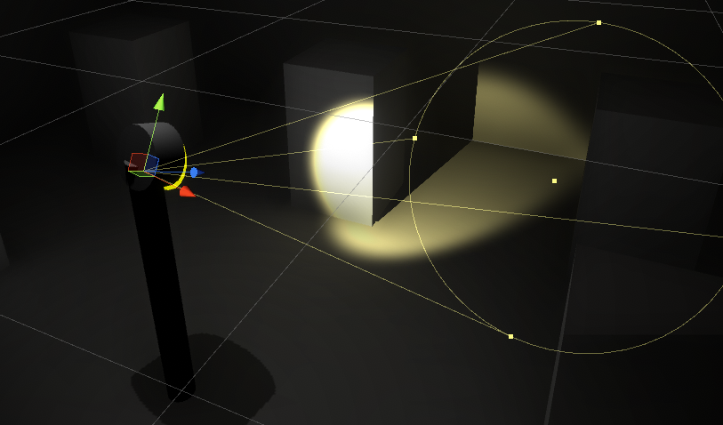

The settings I used can be seen in the dropdown section below, but have a play around with the settings to see what each one does and try and reproduce the image above without cheating!

My Settings

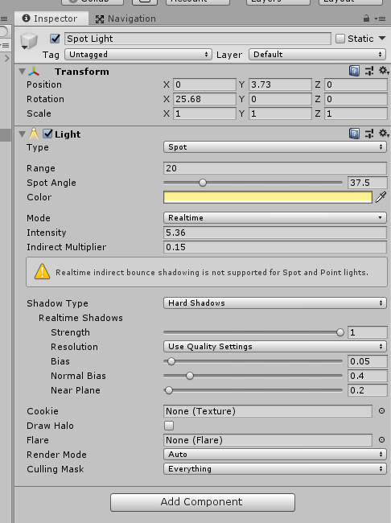

# Rotating the Spotlight
To rotate the spotlight, we will need a script. Go to your scripts folder and create a script called `CS_Rotator` and open it.

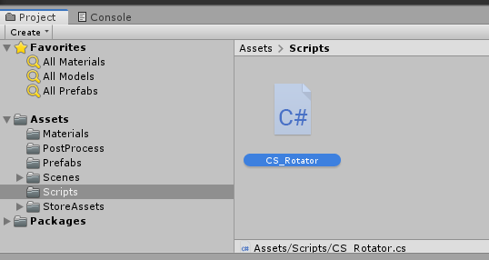

#### Member Variables
We will only need one variable for this script which is going to store our Rotation Speed. Make it a *float* and set it equal to about `10.0f`.

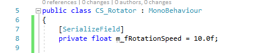

#### Update Function
We are going to **change our `Update()` function to a `FixedUpdate()` function**. This just makes our script run 60 times a second rather than every single frame.

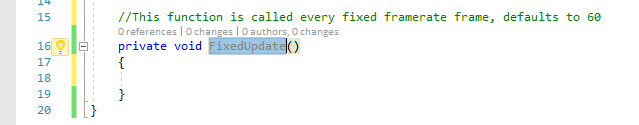

In our `FixedUpdate()` function, we are just simply going to rotate the transform on the up axis by our `RotationSpeed` multiplied by `DeltaTime` to get smooth movement between frames.

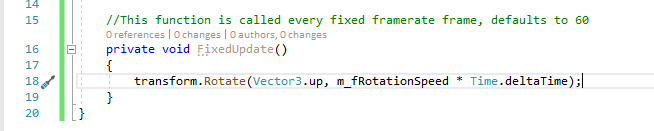

# Adding it to our spotlight
Head back to Unity. Since we want our entire spotlight prefab to rotate, go ahead and drag the `CS_Rotator` script on to the Parent SpotLight game object (*The one shown in the image below!*).

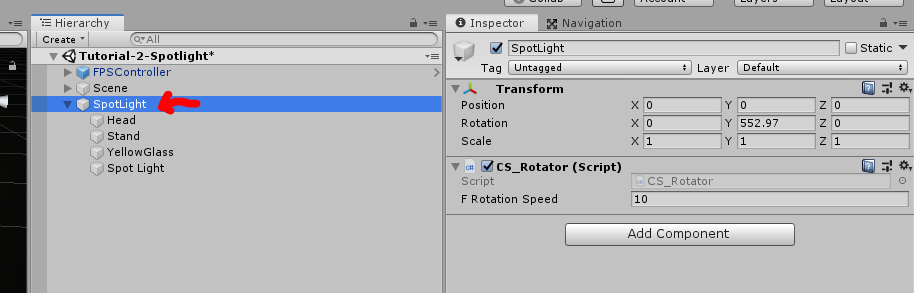

And when you hit play, your SpotLight should start rotating!

# Spotting the Player
There are a few things that we need to set up in order to get our Spotlight to spot our player...

### Trigger Box
The way we are going to check whether the player is in the light of the SpotLight is by setting up a trigger box that spreads out from our Light.

On the `Head` Game Object in the SpotLight prefab, add a new Capsule Collider.

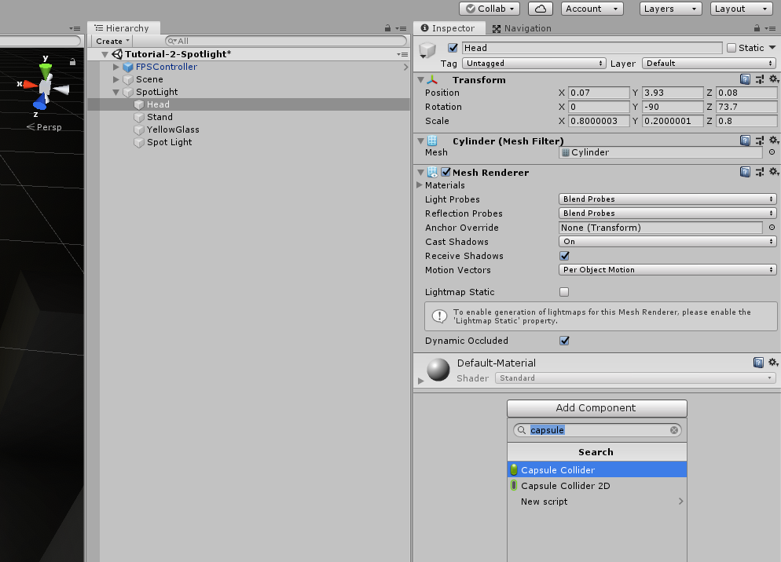

Tick the `Is Trigger` box, and then position the Capsule so that it spreads out from the light like the image below.

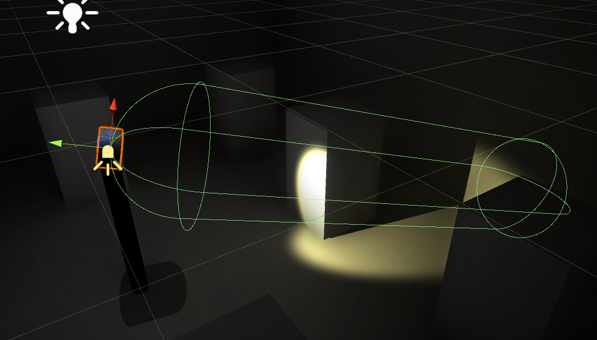

My Settings

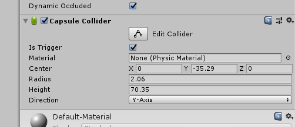

### Script
Next we are going to need a new script! Go to your scripts folder and create a new script called `CS_SpotlightBehaviour`.

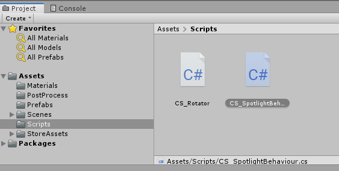

Then drag it on to the `Head` Game Object!

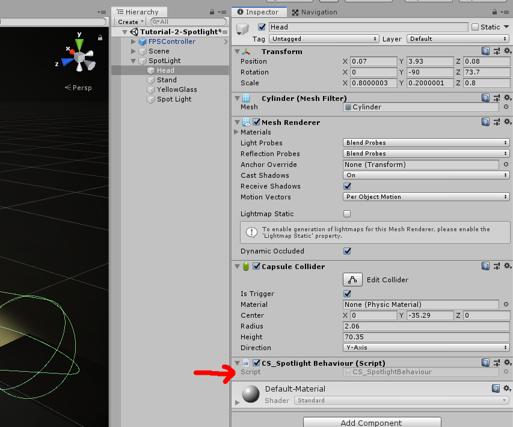

Then open the Script.

#### Member Variables
Firstly, we are going to do a small check to see if the player is in the SpotLight or not by checking if they are in the Trigger box of the Capsule Collider.

If they are in the Trigger Box, we are going to change the Colour of the Light and the Glass Material of the SpotLight prefab.

For this we will need variables for **each of the Materials** that we want to change to depending on whether the player is or isn't in the triggerbox.
We will also need a variable to store the **SpotLight** in so we can change its colour, and we will need another variable to store the **Renderer** of the Glass so we can change its material.
And then last of all **Two Boolean Variables** to store whether the player is in the Trigger box and another to store whether or not they can be seen or not.

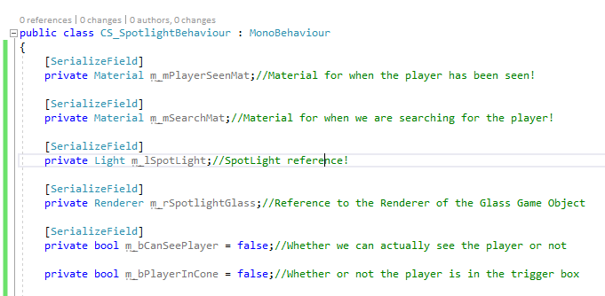

#### Enter and Exit Functions
Firstly we need to check if the player is in the Trigger box area.
To do this, we are going to use Unity's built in Functions `OnTiggerEnter()` and `OnTriggerExit()`!

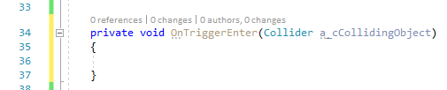

In the Enter function, we are going to do a quick check to see if the Object that entered the Trigger box was the player by checking the objects tag.
If it was, we can set `m_bPlayerInCone` to true!

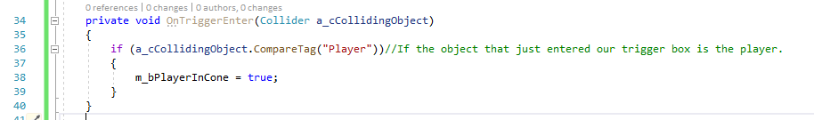

Then we do the same of the Exit function but we set `m_bPlayerInCone` to false instead.

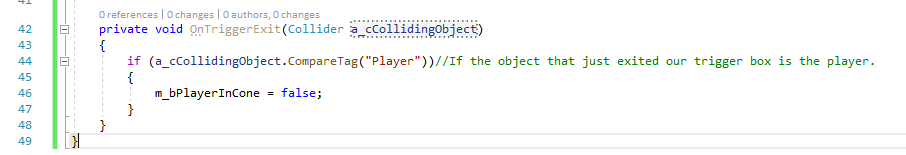

#### Update Function
For now, in the `Update()` function, we are just going to say that if the player is in the trigger box, we can also see them, which we can do by simply typing:

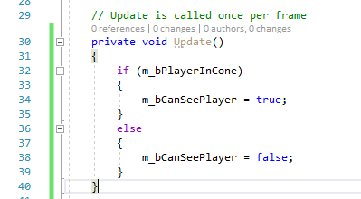

Next, we are going to change the Material of the glass and the colour of our light!

To do this we can do an if/else statement to see if we can see the player.

If we can see the player, we can change the Spotlights colour to the same colour as the Material we are going to change the glass to.
And then the Glass' material to the Seen material.

*Then we can just do the opposite for when we can't see the player!*

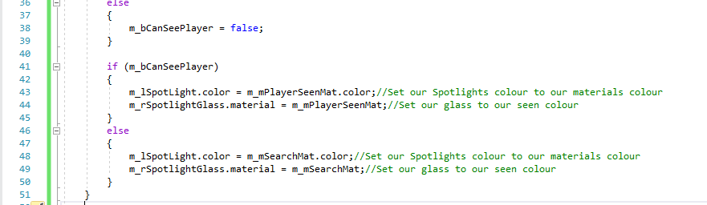

#### Seeing it in Action!
Head back to Unity and click on your Head GameObject, as you can see you now have some empty slots to fill in the Inspector.

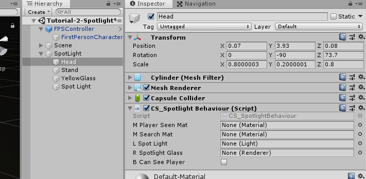

Add the `RealTimeRed` and the `RealTimeYellow` Materials to the PlayerSeenMaterial and the SearchMaterial slots. These are located in your materials folder of the project.

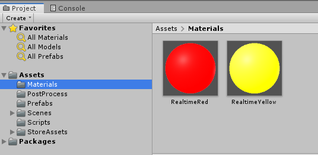

Then drag your Spot Light into the Light slot, and the YellowGlass Game Object into the Spotlight glass slot.

*Afterwards your inspector should look like the following*

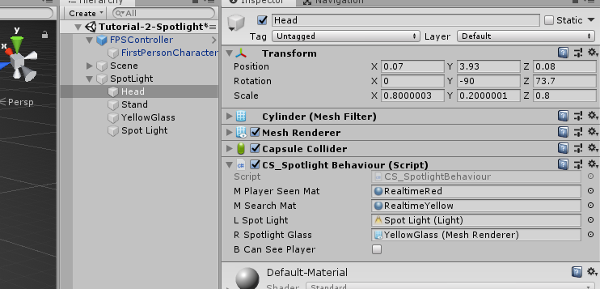

Then when you hit play, your light should turn red when you go into it!

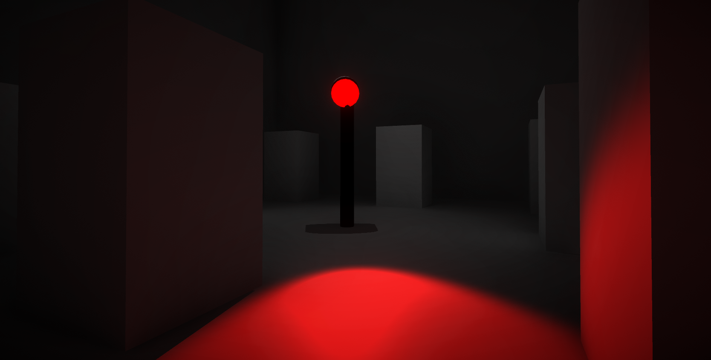

# Getting the Light to follow the player!
We want our search light to follow the player when it can see them, to do this we need to add two lines of code!

#### Member Variables
We need to add a reference to the players Transform so we can get an angle between the spotlight and their position.

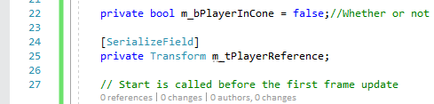

#### Update Function
We then just need to add a `LookAt` funtion that targets our parent game object. We can add this in our if statement where we check if we can see the player or not.

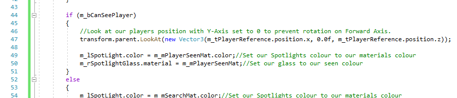

# Trying it out
Head back to Unity and add the FPSController Gameobject into our new PlayerReference spot for our SpotlightBehaviour.

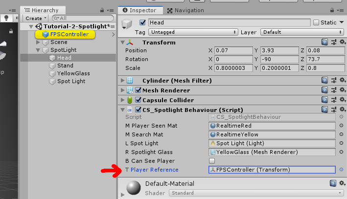

Hit play and see what happens!

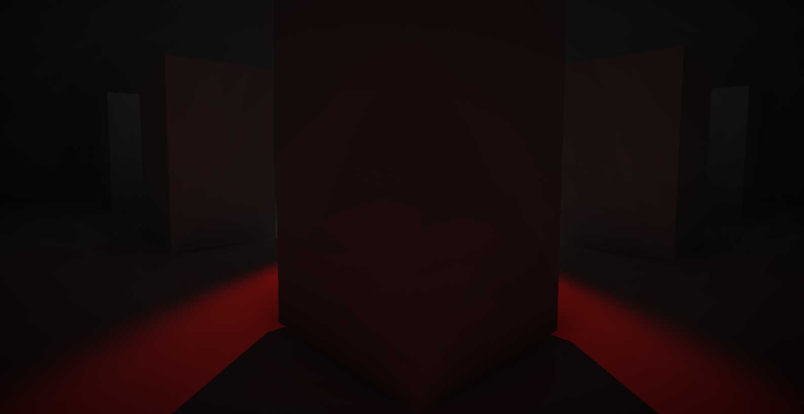

There is now the problem of the Search Light being able to see us through walls...

# Line of Sight Check
To do a Line of Sight check we are going to need to perform a RayCast to see if there are any objects between the Search Light and the Player.
We don't want to be doing this all the time though since RayCasts are expensive on performance, so we only want to do this *when the player is in the trigger box*, which we have already set up!

#### Member Variables
To do a RayCast, we need to specify what Object Layers we want to Ray to check against when checking Line of Sight since we don't want it to see itself.
So we need to declard a LayerMask member variable that we will change in the inspector later.

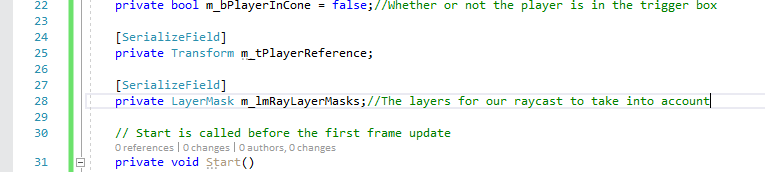

#### Update Function
First of all we are going to need to get a Direction vector so that we know which way to shoot the RayCast so
empty the `m_bPlayerInCone` if/else statement and write the following:

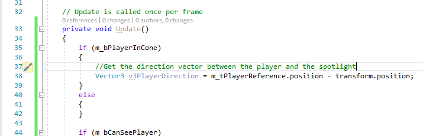

We can then start our Raycast, we start by declaring a RayCastHit variable to store the information about what the Ray first hits when it is fired out.

Then we can write an if statement with a RayCast inside, the parameters go in order:

- Start postion of the Ray
- Direction to fire the ray
- An out variable to store the information about what we hit inside of
- How far to shoot the ray
- What layers to take into account when checking collision

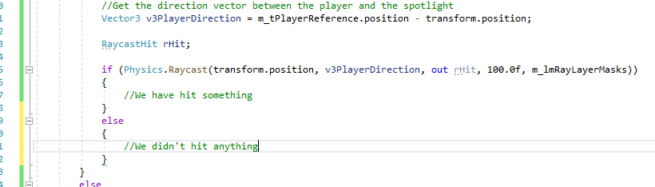

We can then just do a simple check to see if the thing that the Ray hit was the player!

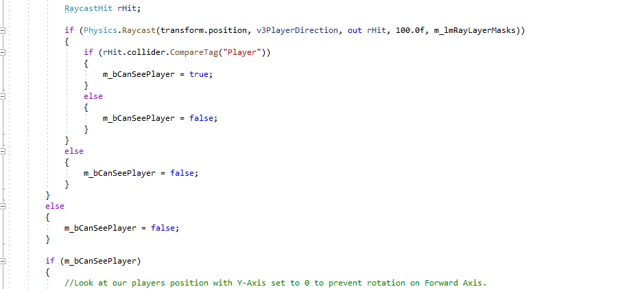

# Trying it out
We can then head back to Unity and click our Head Gameobject and set the layers of our LayerMask in the inspector to take into account **Player** and **Obstacles**.

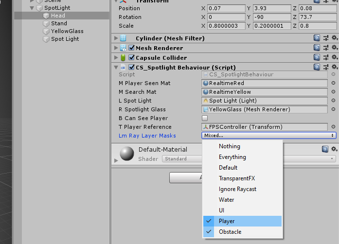

Hit Play and your spotlight should work!