# Emissive Materials

First of all, open the first tutorial scene from the scene folder called `Tutorial-3-EmissiveMaterials`, you should be met with a scene like in the image below.

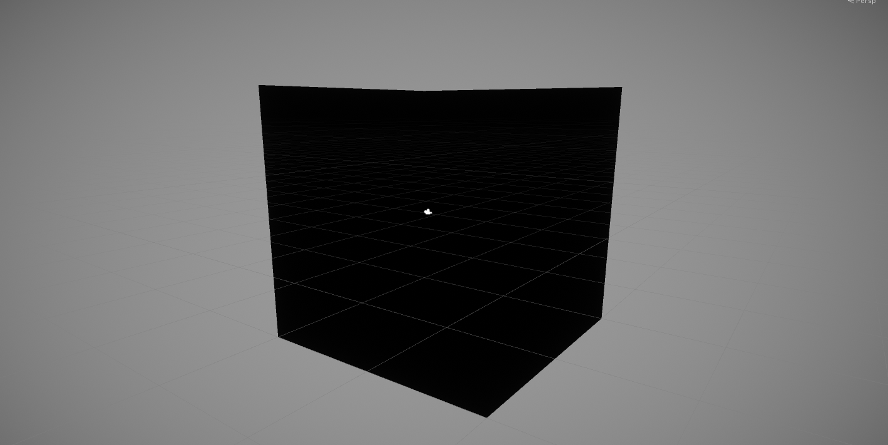

As you can see the scene is currently very dark, to view it without lighting, we can click the Lighting option in the scene view:

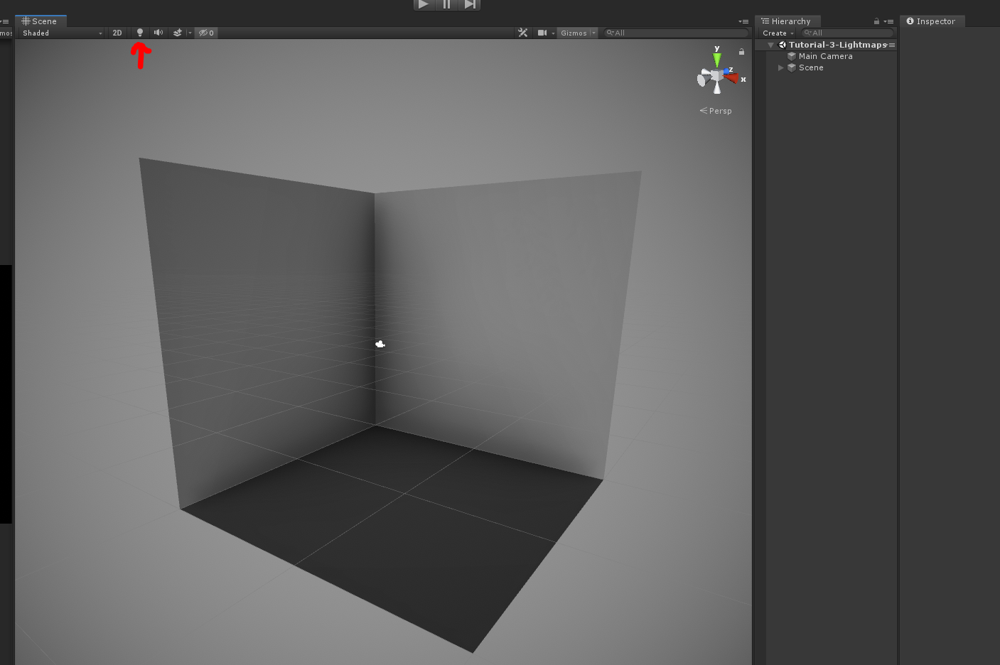

First of all we are going to add a Cube to our scene.

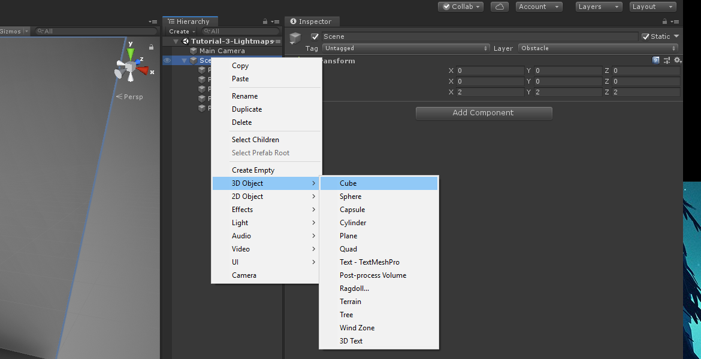

Then we are going to position it at `0,1,0` and scale it by `1,2,1`.

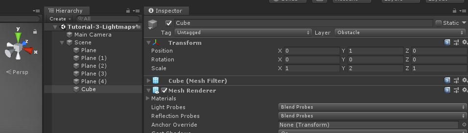

If we turn lighting back on, you can see that it is still very dark in the scene, to fix this, we are going to give the cube an **Emissive Material**.

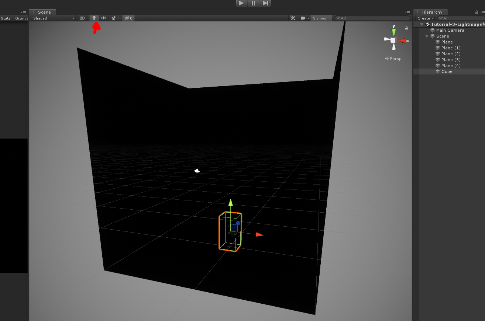

Go to your materials folder and create a new Material, I'm going to call mine `BlueGlow`.

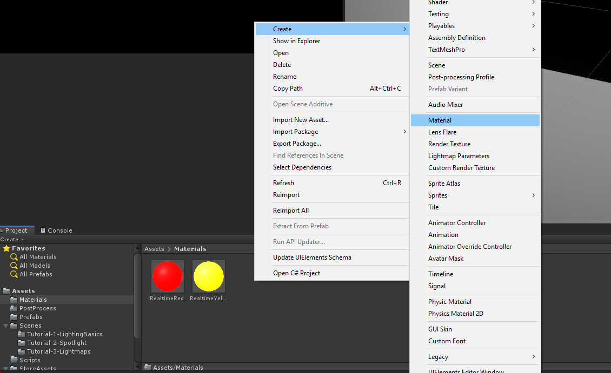

When you click on your material, the inspector will show a range of options, the ones we need to change are:

- **Albedo Colour** - This will be the colour of the surfaces of any object you apply the material to
- **Emission** - Ticking this will make it so Light emits from any object you apply the material to
- **Colour** - This is the colour of the light that will be emitted
- **Global Illumination** - Set this to `Baked` so that we can generate a light map from our objects.

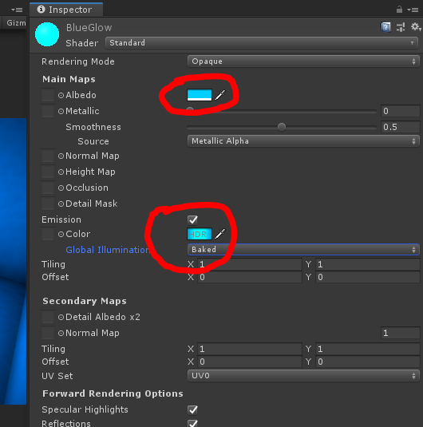

When we apply this material to our cube, we can see the Cube material is lit up, but the rest of our scene is not, this is because we need to bake a Light map for our object.

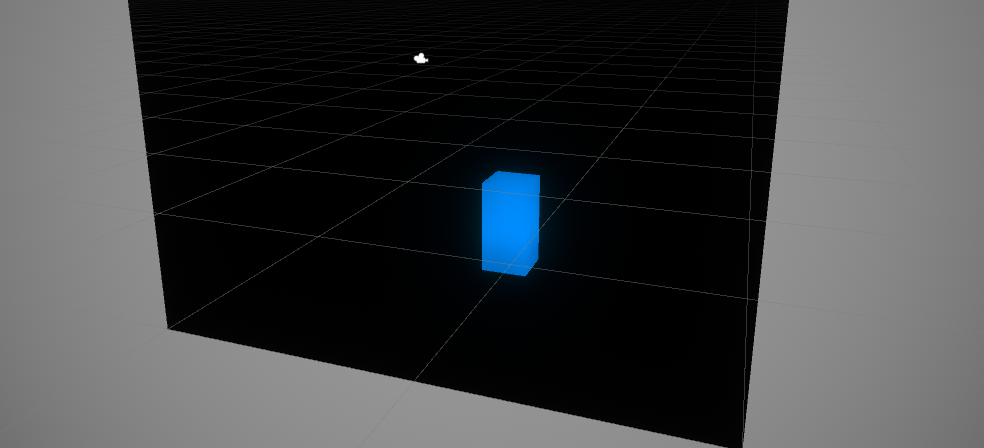

Start by setting our Cube to Static, this tells the Lighting system that it is a stationary light source, so that it is safe to bake its lighting settings.

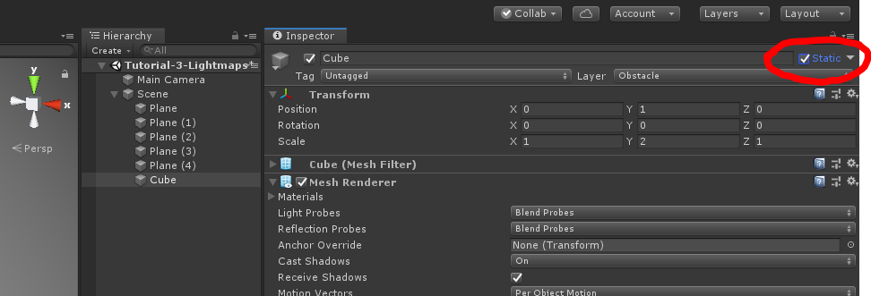

We can then open the Lighting Settings to start generating our Lightmap by going to `Window > Rendering > Lighting Settings`.

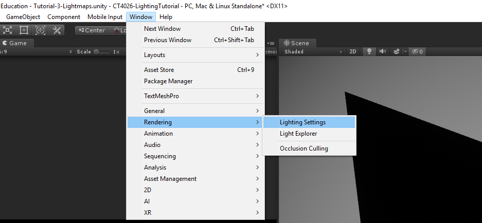

Scroll down to `Lightmapping Settings`, the default options will be fine. Depending on whether or not you have the correct Graphics Drivers installed you may be able to use a different Lightmapper.

- **Progressive GPU** - This will use your graphics card to generate the Lightmap and is considerably faster than using the CPU, but requires you to update your graphics drivers.
- **Progressive CPU** - This will use your CPU to generate the Lightmap but is quite slow.

Once you have chosen your Lightmapper, hit `Generate Lighting`.

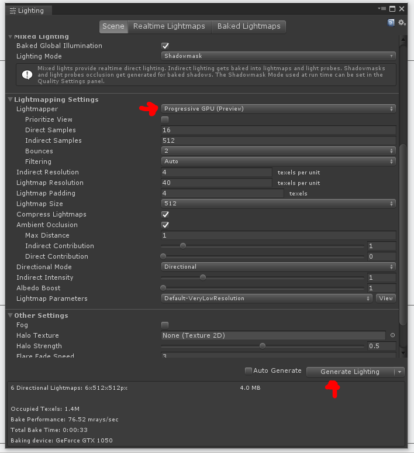

When baking, you can see the progress bar and how long it will take in the bottom right of the Unity Window.

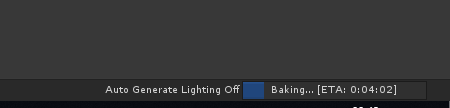

As you can see the Cube is lighting up the scene, but not by very much, we can change this in our material settings.

Head back to your material and click on the Emission Colour, and set the `Intensity` to `2.5` or a value of your choosing and then Generate your Lightmap again.

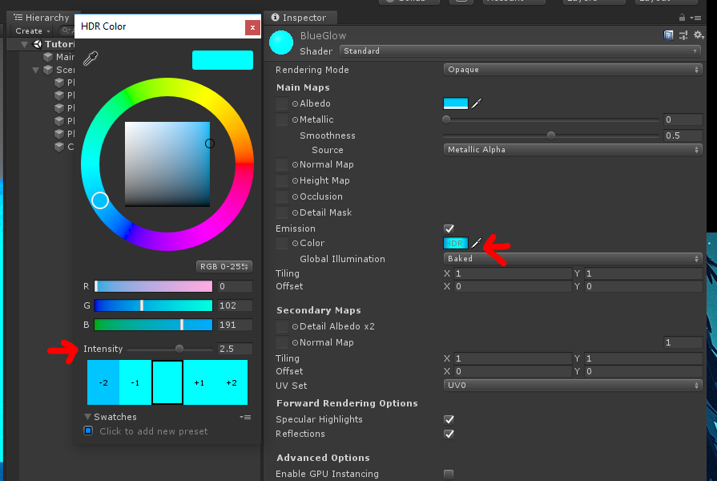

Now we can see the full scene lit by our Emissive material!

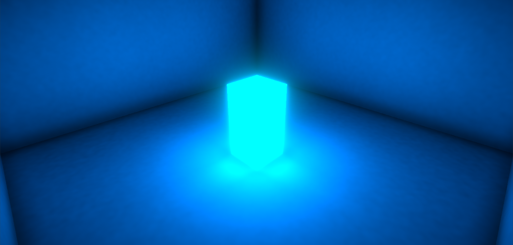

Toy around with some options and add some more materials to see how it affects your scene!

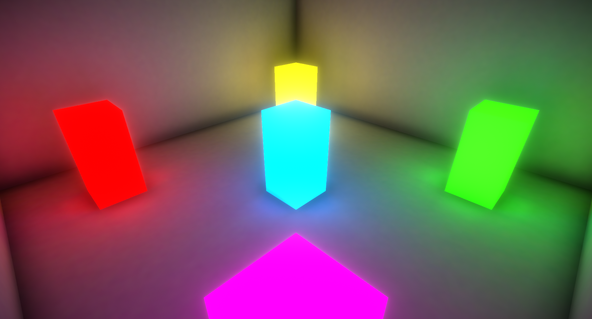