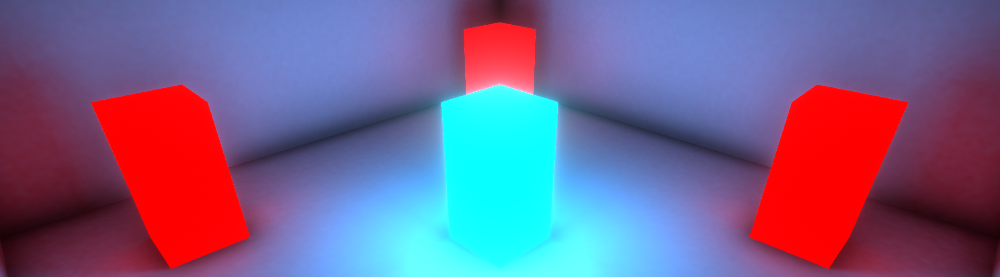

# CT4026 - SEM2 - Week 1 - Tutorial
This repository contains the starting point for the Lighting tutorial for the Games Engine Scripting module, it will go over the following:

- Interacting with a single Light through script
- Interacting with multiple lights all at once through script
- Using a spotlight to create a search light that changes colour when it can see the player
- Using emissive materials to create make an entire object a light source
- Generating light maps to help performance

# Requirements
Programs you will need:

- Unity **2019.1.9f**
- Visual Studio
- GitHub Desktop (Or your preferred Git program)

## Tutorials
List of tutorials for this session:

1. [Basic Scripting with Realtime lights](CT4026-LightingTutorial-1-ControllingLightsViaScript.md)
2. [Enemy Search Light Tutorial](CT4026-LightingTutorial-2-SearchLight.md)
3. [Emmissive materials and Lightmaps](CT4026-LightingTutorial-3-EmissiveMaterials.md)

## Recommended Reading
Books listed are available via the Library.

- [Unity Emission Documentation](https://docs.unity3d.com/Manual/StandardShaderMaterialParameterEmission.html)
- [Unity Lights Documentation](https://docs.unity3d.com/Manual/Lighting.html)